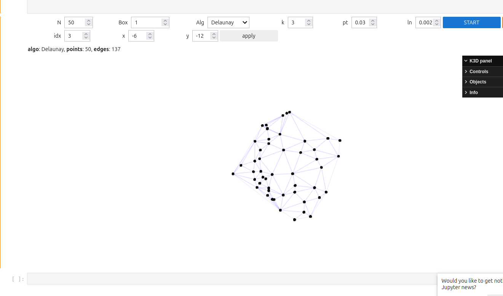
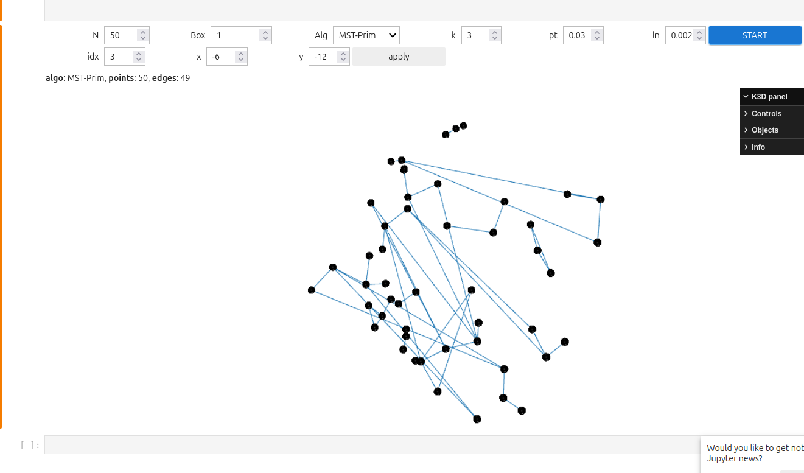
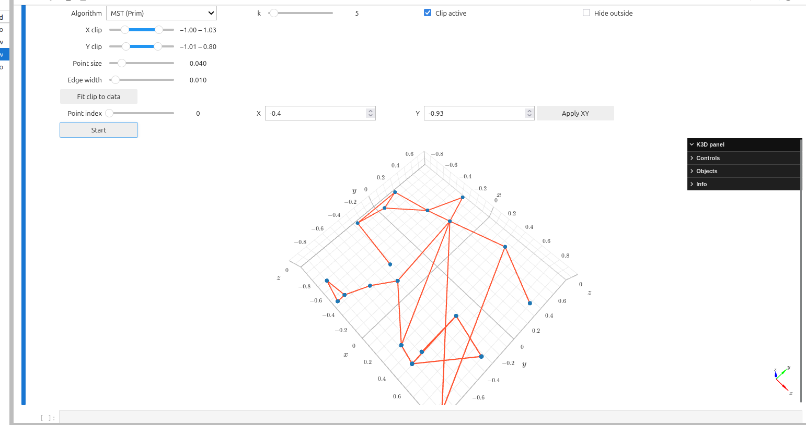

#Graph & Geometry Algorithms in Python

This project provides Python implementations of classical computational geometry and graph algorithms:
- Delaunay Triangulation(Bowyer–Watson)
- Gabriel Graph (GG)
- Relative Neighborhood Graph (RNG)
- k-Nearest Neighbors Graph (kNN)
- Minimum Spanning Tree (MST):
  - Prim's Algorithm
  - Kruskal's Algorithm

The project uses `matplotlib` and `k3d` for visualization
##Visualizations

Delaunay Triangulation 

Minimum Spanning Tree (Prim's Algorithm, 2D)

MST in 3D with k3d

